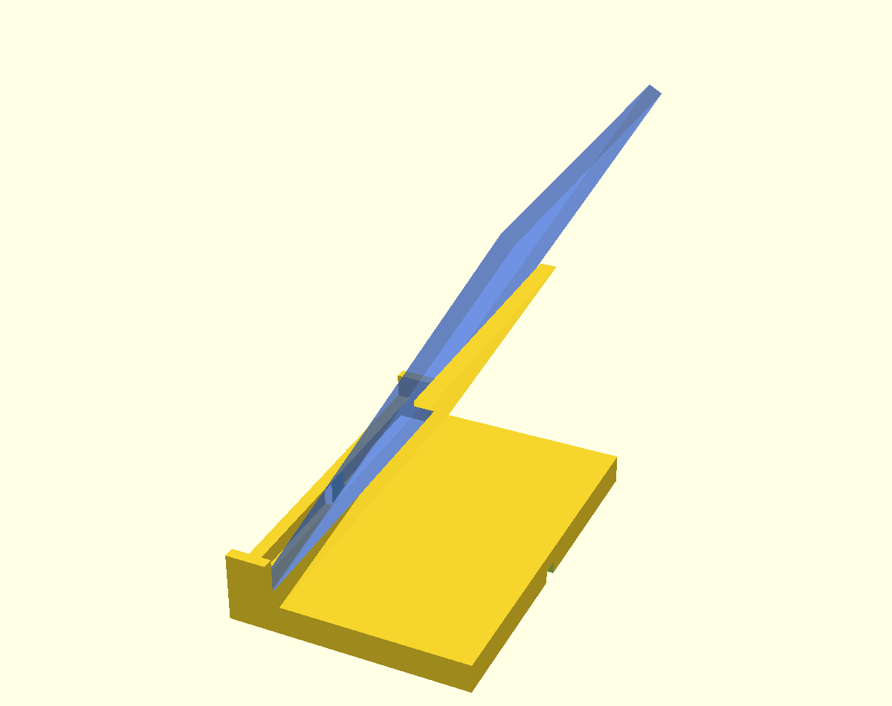

# iPad-holder til butik (Prusa MK4S)

Parametrisk 3D-model af en **lænende bordstander** til vores **iPad 11 (A16, 2025)**.
Inspireret af Durable-aluminiumsholderen: iPad'en læner bagover i en passende vinkel,
underkanten hviler i en slids, og der er en **kabel-udsparing** så den kan lades mens
den sidder i holderen — lige til en disk i butikken.

Designet i **OpenSCAD** (kode = præcис pasform på millimeteren og nemt at justere).

## Filer

| Fil | Hvad |
|-----|------|
| `ipad_holder.scad` | Selve modellen. Alle mål ændres her. |
| `ipad_holder.stl` | Klar til print (fritstående, ingen skruehuller). |
| `ipad_holder_skruehuller.stl` | Samme, men med 4 huller så den kan skrues fast til disken. |
| `renders/` | Billeder af modellen (preview). |

## Mål (default-design)

- **Holder:** ca. **130 mm dyb × 193 mm bred × 128 mm høj** → passer på MK4S-pladen (250×210×220) med god margin.
- **iPad 11:** 248,6 × 179,5 × 7,2 mm. Orientering: **portrait** (stående), USB‑C i bunden.
- **Lænevinkel:** **30° fra lodret** (= 60° fra vandret) — god vinkel når man **står og kigger ned** på skærmen ved en disk.
- **Frontlæbe:** 9 mm → dækker kun iPad'ens ramme (~10,8 mm), **ikke skærmen**.
- **Slidstykkelse:** 12 mm → regner med iPad **med et tyndt cover**. Se "Tilpas" hvis I bruger bart eller robust cover.

### Hvilken vinkel skal I vælge?
Princippet: skærmen skal stå ~vinkelret på synslinjen. Tommelfingerregel: **hældning bagover fra lodret ≈ hvor mange grader synslinjen falder under vandret**. For en typisk disk (~95 cm) og en kunde der står ~40–50 cm fra:

| Situation | `lean_angle` (fra lodret) |
|-----------|---------------------------|
| Skærm i ~øjenhøjde, mest til at kigge på | 12–20° |
| **Disk, kunde står og kigger ned (default)** | **30°** |
| Lav disk / kunde står helt tæt / meget nedad | 35–45° |

> Vigtigt: jo mere I læner den tilbage, jo **lavere** skal `lip_height` være (ellers dækker læben skærm), og jo **dybere** skal `base_depth` være (ellers vælter den bagover). Modellen skriver selv kontroltal i konsollen (læbe-dækning + tyngdepunkt) når I trykker F5.

## Print på Prusa MK4S

- **Orientering:** Print den **som den står** (bunden ned mod pladen). Ingen support nødvendig — ryglænet hælder kun 18° fra lodret, og kabelrillen er åben nedad, så der skal ikke brolægges.
- **Materiale:** PLA er fint indendørs. Står den i direkte sol/varme i vinduet, så brug **PETG** (PLA bliver blødt ved ~55 °C).
- **Forslag til slicer:**
  - Lag: 0,2 mm
  - Perimetre: 3–4
  - Top/bund: 5 lag
  - Infill: 15–20 % (gerne gyroid)
  - Brim: 5 mm (god vedhæftning pga. den høje, lænende del)
- **Farve/finish:** En mørk eller neutral farve ser pænest ud i en butik.

> Tip: vil I have den **ekstra tung og stabil**, så print bunden med højere infill (eller læg en metalplade/vægt på fundamentet bagest). Til offentligt brug kan I bruge `ipad_holder_skruehuller.stl` og skrue den fast til disken.

## Tilpas designet

Åbn `ipad_holder.scad`, ret tallene øverst, tryk **F5** (preview) / **F6** (render), og **F7** for at eksportere ny STL. De vigtigste:

| Parameter | Betydning | Tip |
|-----------|-----------|-----|
| `slot_thickness` | Tykkelsen slidsen passer til | Bart iPad ≈ **9**, tyndt cover ≈ **12** (default), robust cover ≈ **18**. **Mål jeres cover!** |
| `lean_angle` | Grader fra lodret | 30 = default (kigge ned). Mindre = mere oprejst. Se vinkel-tabellen ovenfor. |
| `orientation` | `"portrait"` / `"landscape"` | Se note om kabel nedenfor. |
| `support_frac` | Hvor højt ryglænet støtter | 0,5 = halvvejs op. Højere = mere støtte, mere filament. |
| `lip_height` | Hvor meget frontkanten griber | Hold den < 10,8 × cos(vinkel) så den kun dækker rammen. |
| `base_depth` | Fundamentets dybde | Større = mere stabilt mod at vippe. |
| `screw_holes` | Huller til fastskruning | `true` til offentligt brug. |
| `show_device` | Tegn en "spøgelses‑iPad" | Kun til preview — så kan I se pasformen. |

### Vigtigt om kablet og orientering
USB‑C‑porten sidder midt på iPad'ens **korte kant**:
- **Portrait (default):** porten ender i **bunden midt på** → kablet føres lige ned i udsparingen og ud bagud gennem rillen i fundamentet. Reneste løsning.
- **Landscape:** så ender porten **ude på siden** i ca. midterhøjde. Den centrale bund-udsparing rammer den derfor ikke — her føres kablet bare ud over sidetappen. Sæt `orientation="landscape"` (holderen bliver bredere og mere stabil), og I behøver normalt ingen bund-udsparing.

## Hvorfor OpenSCAD og ikke "noget med AI/MCP"?
Til en **funktionel del med præcise pasninger** (en iPad-slids på 0,x mm) er parametrisk
kode det rigtige værktøj: reproducerbart, nemt at ændre ét mål, og det eksporterer en
ren, vandtæt STL direkte. Text‑to‑3D / mesh‑AI er gode til organiske former, men upræcise
til den slags pasninger. Der var heller ingen CAD‑MCP tilgængelig i sessionen — så
OpenSCAD er både det bedste og det mest direkte valg her.
